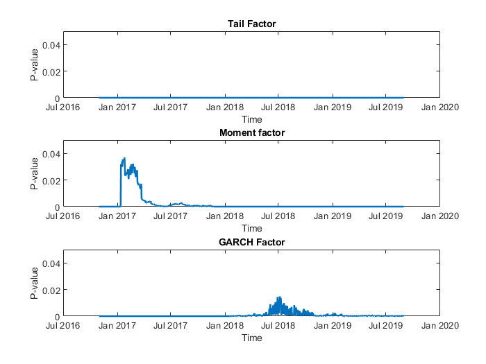

[](http://quantlet.de/)

## [](http://quantlet.de/) **CONV_cryptos** [](http://quantlet.de/)

```yaml

Name of Quantlet: CONV_cryptos

Published in: Genus_proximum_cryptos

Description: 'This quantlet shows the convergence of cryptocurrencies over time, by computing Likelihood Ratio from binary logistic regression.'

Keywords: cryptocurrency, genus proximum, classiffication, clustering, classification, multivariate analysis, convergence
 
Author: Daniel Traian Pele and Niels Wesselhöfft

See also: SFA_cryptos, FA_cryptos, DFA_cryptos, Mkt_cryptos, VCS_cryptos

Submitted: 2019-04-05

Datafiles: 'data_dynamic.mat'

Example : Please download and extract the 5 rar volumes in order to get the datafile

```




### MATLAB Code
```matlab

%% Factor modelling of assets

%% Global Commands

clear;clc;

% specify directoy for the files
directory='D:\PROIECTE\Cryptos 2019\Data';
addpath(genpath(directory))
cd(directory)

%set global commands for font size and line width
size_font=9;
size_line=1.5;
set(0,'DefaultAxesFontSize',size_font,'DefaultTextFontSize',size_font);
set(0,'defaultlinelinewidth',size_line)

% figures
set(0, 'defaultFigurePaperType', 'A4')
set(0, 'defaultFigurePaperUnits', 'centimeters')
set(0, 'defaultFigurePaperPositionMode', 'auto')
figure_wide=[680 678 800 420];

% colors
color_blue=[0 102 204]./255;
color_green=[0 204 102]./255;
color_red=[204 0 0]./255;
color_black=[0 0 0];

% reset rngs before running
rng(1)

%% Data

load data_dynamic.mat

subset=[1:3 4 6   8:23 26:27];
%subset=[1:27];
 stats_s=stats_raw(:,subset);

est_labels_raw={'Variance'; 'Skewness';'Kurtosis';...
    'Stable \alpha';'Stable \beta';'Stable \gamma';...
    'Stable \delta';'Q_{5%}';'Q_{2.5%}';'Q_{1%}';'Q_{0.5%}';...
    'CTE_{5%}';'CTE_{2.5%}';'CTE_{1%}';'CTE_{0.5%}';...
    'Q_{95%}';'Q_{97.5%}';'Q_{99%}';'Q_{99.5%}';...
    'CTE_{95%}';'CTE_{97.5%}';'CTE_{99%}';'CTE_{99.5%}';...
    'ACF Lag 1'; 'Hurst';'GARCH parameter';'ARCH parameter'};
est_labels=est_labels_raw(subset,1);


%% Expanding window factor model

t_start=ceil(t_max/2);
user_factor=2;

    

% init
[loadings,F,f2] = factor_an_static(stats_s);


for j=[1:740]%(t_max-t_start)
    time(j,1)=datetime(date_unique(j+t_start-1,1),'ConvertFrom','datenum');
    % stats for one point in time
    stats_t=stats(:,:,j);

    % nan assets
    assets_nan=sum(isnan(stats_t),2)>0;
    stats_t(assets_nan,:)=[0];
    
    parms_nan=sum(isnan(stats_t),1)>0;
    stats_t(:,parms_nan)=[0];
    Rho=corr(stats_t);
    Rho(isnan(Rho))=0;
    n1 = length(stats_t);
    m  = mean(stats_t);
    zz = (stats_t - repmat(m,n1,1))./repmat(sqrt(var(stats_t)), n1, 1);
    zz(isnan(zz))=0;
    %f2=inv(Rho)*loadings;

    % F contains the final scores after the varimax rotation;
    F=zz*f2;

type_crypto=strcmp(type_assets,'Crypto');

type_crypto_mod=type_crypto+1;

c=zeros(size(type_crypto_mod));
df=n_assets-2;


for i=1
    
   
   mdl = fitglm(F(:,1),type_crypto,'Distribution','binomial');
   tbl = table2array(devianceTest(mdl));
end
    Dev_F1(j,1)=tbl(2,1);
    p_value_F1(j,1)=tbl(2,4);

    
for i=2
   mdl = fitglm(F(:,2),type_crypto,'Distribution','binomial');
     tbl = table2array(devianceTest(mdl));
end
     Dev_F2(j,1)=tbl(2,1);
    p_value_F2(j,1)=tbl(2,4);

for i=3
   mdl = fitglm(F(:,3),type_crypto,'Distribution','binomial');
     tbl = table2array(devianceTest(mdl));
end
      Dev_F3(j,1)=tbl(2,1);
      p_value_F3(j,1)=tbl(2,4);

 
   
end
%Conv_index_1=1-(Dev_F1)/max(Dev_F1)
%Conv_index_2=1-(Dev_F2)/max(Dev_F2)
%Conv_index_3=1-(Dev_F3)/max(Dev_F3)

%% Figures
h=figure()
y_lim=[0 140];


ax1 = subplot(3,1,1); % top subplot


plot(time,Dev_F1);
%ylim(y_lim);
ylabel('Likelihood Ratio');
xlabel('Time');
title(ax1,'Tail Factor');

ax2 = subplot(3,1,2); % bottom subplot
plot( time,Dev_F2);
%ylim(y_lim);
ylabel('Likelihood Ratio');
xlabel('Time');

title(ax2,'Moment Factor')

ax3 = subplot(3,1,3); % bottom subplot
plot(time,Dev_F3);
%ylim(y_lim);
ylabel('Likelihood Ratio');
xlabel('Time');

title(ax3,'GARCH Factor');

y_lim=[0 0.05];

h=figure()


ax1 = subplot(3,1,1); % top subplot


plot(time, p_value_F1);
ylim(y_lim);
ylabel('P-value');
xlabel('Time');
title(ax1,'Tail Factor');

ax2 = subplot(3,1,2); % bottom subplot
plot( time, p_value_F2);
ylim(y_lim);
ylabel('P-value');
xlabel('Time');

title(ax2,'Moment factor')

ax3 = subplot(3,1,3); % bottom subplot
plot(time, p_value_F3);
ylim(y_lim);
ylabel('P-value');
xlabel('Time');

title(ax3,'GARCH Factor');


   
   
 
```

automatically created on 2020-01-15